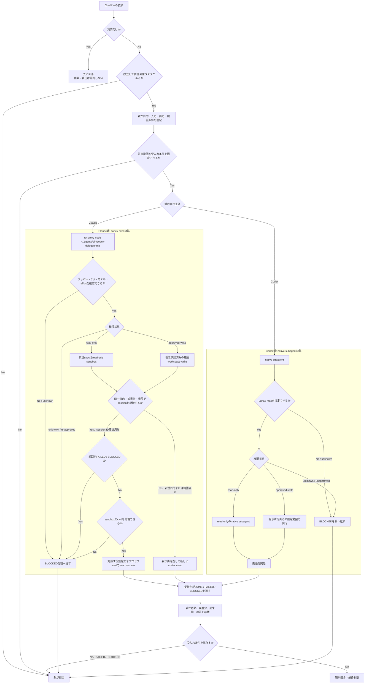
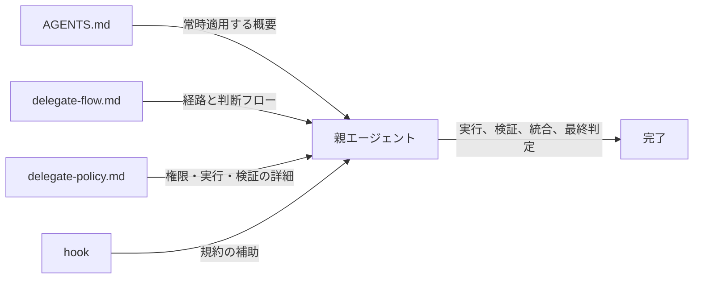

# Delegate選択フロー

この文書は、`~/.agents/AGENTS.md`の委任方針を素早く判断するためのクイックリファレンスである。詳細な実行条件、権限、再開、禁止操作、結果形式は`~/.agents/references/delegate-policy.md`を参照する。

## 基本フロー

経路、モデル、effortが利用不能または`unknown`なら、Codex MCPや別モデルへ自動で切り替えず親が担当する。`FAILED`や`BLOCKED`も親へ戻し、自動再試行しない。

## 実行主体別の標準経路

| 親エージェント | 標準経路 | モデル・effort | 権限と利用不能時 |
|---|---|---|---|
| Claude | `rtk proxy node ~/.agents/bin/codex-delegate.mjs`経由で`codex exec` | `gpt-6-luna` / `max` | 読み取り専用を既定にする。利用不能・不明なら親が担当 |
| Codex | native subagent | `gpt-6-luna` / `max` | 読み取り専用を既定にする。指定不可・不明なら親が担当 |

書き込みはユーザーが承認した作業だけに限る。親が変更内容、許可パス、禁止操作、検証条件を指定し、Codex CLIでは`workspace-write`を使う。`danger-full-access`や承認回避は使わない。承認状態または許可範囲が不明なら`BLOCKED`で親へ戻す。

## resumeの判断

- 同じ目的・成果物・許可パス・承認状態の追跡だけ、確認済みsession IDで`codex exec resume <session-id>`を使う。
- session IDは`codex exec --json`のJSONLイベントから取得する。IDがない、矛盾する、または確認できない場合はresumeせず`BLOCKED`。
- 目的、受入れ条件、権限または許可範囲が変わったら、新しいタスクを定義する。
- 前回が`FAILED`または`BLOCKED`なら自動resume・再試行をせず、親が原因を確認して次を決める。
- 継続が必要な実行では`--ephemeral`を使わない。
- `codex exec resume`は`--sandbox`と`-C` / `--cd`に対応しない。ラッパーはsandboxを設定値で明示し、子プロセスの作業ディレクトリを固定する。CLIがこの指定方法に対応しない場合は起動せず`BLOCKED`を親へ返す。

## 結果と親の責務

子の最終状態は`DONE`、`FAILED`、`BLOCKED`のいずれか1つとする。`DONE`は指定作業と条件を満たした場合だけ返す。異常終了、timeout、不正または欠落した結果は成功として扱わず、親へ戻す。

親は報告文ではなく実際の差分、変更ファイル、成果物、検証結果を確認する。`DONE`でも親の受入れ確認が終わるまでは統合済みとしない。失敗や受入れ不能時は親が引き継ぎ、別経路への黙ったフォールバックをしない。

- hookは方針を補助するだけで、実行主体、モデル、経路、承認状態を自動判定・選択・生成しない。
- AGENTS.mdは常時適用する原則と詳細文書への入口を担う。
- この文書は経路の選択フロー、delegate-policy.mdは実行上の詳細条件を担う。
- 分解、横断的な統合、設計判断、品質判定、最終報告は親が担う。
