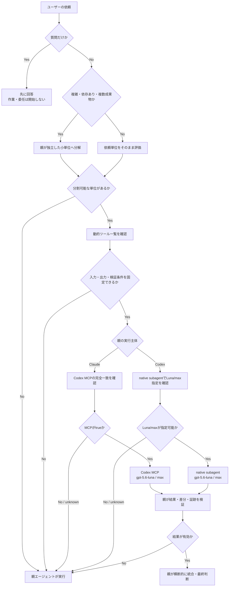
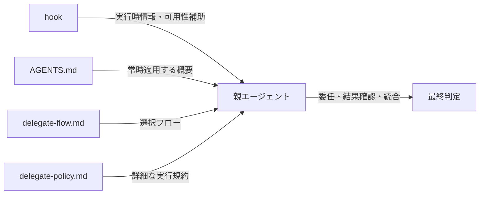

# Delegate選択フロー

この文書は、`~/.agents/AGENTS.md`のdelegate方針を素早く判断するためのクイックリファレンスである。詳細な実行条件、権限、禁止操作、検証条件は`~/.agents/references/delegate-policy.md`を参照する。

## 基本フロー

## 選択肢の要約

| 条件 | 委任先 | 主な用途 |
|---|---|---|
| 複雑な作業の分解・タスク整理 | 親 | 独立した小単位を作り、分割可能な単位をLuna/maxへ委任 |
| 分割可能な読み取り・抽出・探索 | Luna max | 調査、探索、観点別レビュー、ログ確認 |
| 実装、コードレビュー、保存後の再検証 | Luna max | 変更、ツール連鎖、品質に関わる確認 |
| 分解後の横断的な統合、設計判断、最終判定 | 親 | 要件整理、優先順位、統合、品質ゲート |

委任可能な作業でも、入力が曖昧、許可範囲を固定できない、Luna/maxの経路が`false`または`unknown`、または結果の検証条件を定義できない場合は親が担当する。別モデルへの暗黙のフォールバックは行わない。

## 実行主体別の標準経路

| 親エージェント | 標準経路 | モデル | 経路不明・利用不能時 |
|---|---|---|---|
| Claude | Codex MCP | `gpt-5.6-luna` / `max` | 親が担当 |
| Codex | native subagent | `gpt-5.6-luna` / `max` | 親が担当 |

## 責務分担

- hookはMCP可用性や候補情報を補助するが、モデルや経路を自動起動・自動選択しない。
- AGENTS.mdは常時適用する原則と選択肢だけを保持する。
- この文書は選択判断の視覚的な入口である。
- delegate-policy.mdは実行時の詳細条件と安全制約の正本である。
- 最終的な統合、品質ゲート、ユーザー報告は親エージェントが担う。
