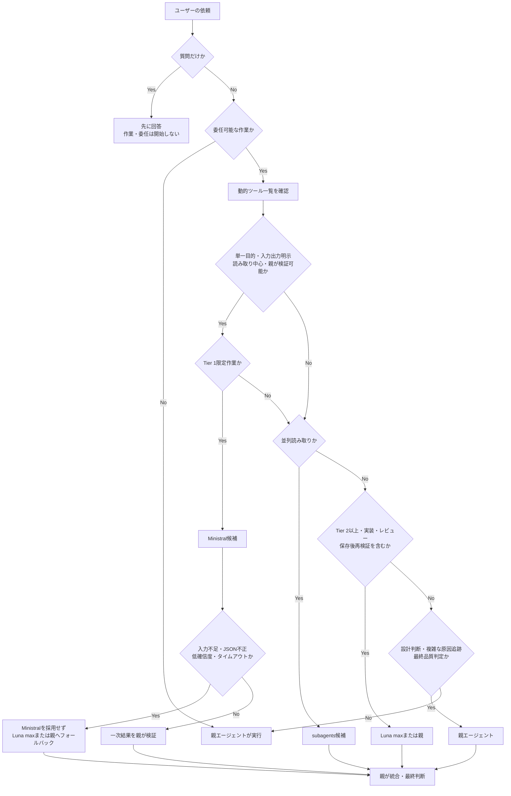
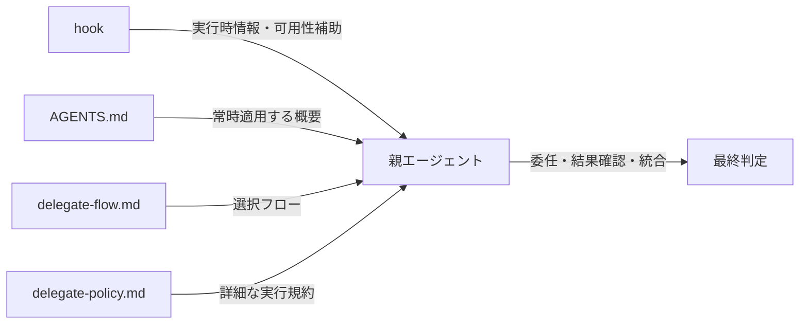

# Delegate選択フロー

この文書は、`~/.agents/AGENTS.md`のdelegate方針を素早く判断するためのクイックリファレンスである。詳細な実行条件、権限、禁止操作、検証条件は`~/.agents/references/delegate-policy.md`を参照する。

## 基本フロー

## 選択肢の要約

| 条件 | 委任先 | 主な用途 |
|---|---|---|
| Tier 1限定、単一目的、読み取り中心、親が検証可能 | Ministral | 短い分類・抽出・固定形式変換、画像一次解析 |
| 独立して並列実行できる読み取り | subagents | 調査、探索、観点別レビュー、ログ確認 |
| Tier 2以上、実装、コードレビュー、保存後の再検証 | Luna maxまたは親 | 変更、ツール連鎖、品質に関わる確認 |
| 設計判断、複数成果物、複雑な原因追跡、最終判定 | 親 | 要件整理、優先順位、統合、品質ゲート |

## Ministralの扱い

Ministralはhookが自動実行・自動選択するモデルではない。親エージェントが次の条件をすべて満たす場合だけ候補にする。

- 目的が1つに限定されている
- 入力範囲と出力形式が明示されている
- 読み取り中心である
- 親エージェントが結果を検証できる

コードレビュー、候補ファイル編集、保存後の再検証を含むツール連鎖、設計判断、最終品質判定には使わない。JSON不正、入力不足、低確信度、タイムアウト、画像未読の場合は画像や入力を推測で削減せず、Luna maxまたは親へフォールバックする。

## 責務分担

- hookはMCP可用性や候補情報を補助するが、Ministralを自動実行・自動選択しない。
- AGENTS.mdは常時適用する原則と選択肢だけを保持する。
- この文書は選択判断の視覚的な入口である。
- delegate-policy.mdは実行時の詳細条件と安全制約の正本である。
- 最終的な統合、品質ゲート、ユーザー報告は親エージェントが担う。
